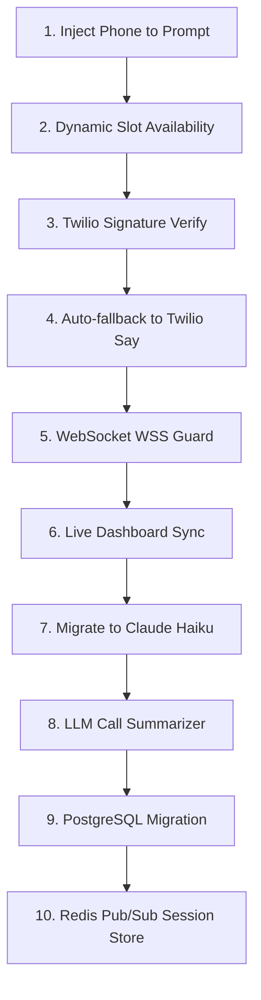

# Project Audit Report: Receptra

This document presents a comprehensive audit of **Receptra**, evaluating its suitability as a production-ready AI Voice Receptionist for StyleCraft Barber. We evaluate the system against the 10 core steps of the customer booking journey and identify blockers, security risks, architecture/scalability concerns, performance bottlenecks, and a prioritized implementation roadmap.

---

## Customer Journey Analysis & Audit

The system was evaluated against the 10 customer journey steps:

| Journey Step | Status | Technical Verification & Audit Notes |
| :--- | :---: | :--- |
| **1. Call the Twilio phone number** | **PASS** (with caveats) | Twilio HTTP POST to `/twilio/voice` correctly returns a TwiML packet directing the call to a media stream. However, the WS URL resolution falls back to `ws://` if not running behind an HTTPS proxy with `x-forwarded-proto` set. Twilio strictly mandates `wss://`. |
| **2. Speak naturally** | **PASS** | Deepgram streaming STT processes the 8kHz mu-law audio buffer and uses `nova-2-phonecall` model for transcription. Interim results and endpointing are correctly handled. |
| **3. AI understands request** | **PASS** | Claude correctly receives user speech input and leverages the system prompt. Fallback simulation mode is implemented in case the API key is not active. |
| **4. AI checks availability** | **FAIL** (Logic Defect) | Claude calls the `check_availability` tool. However, the tool calculates availability in static **30-minute intervals** regardless of the requested service duration. A 60-minute service (like Facial) might be recommended for a slot that has only 30 minutes free before the next appointment, causing booking collision. |
| **5. AI books haircut appointment** | **FAIL** (UX Defect) | Claude calls `create_appointment`. However, the caller's phone number is **not injected** into Claude's system prompt. Because the tool schema requires `customerPhone`, Claude is forced to ask the customer to verbally state their phone number even though the server already has it from the Twilio Caller ID. |
| **6. AI confirms booking verbally** | **PASS** (with caveats) | The ElevenLabs TTS WebSocket stream produces `ulaw_8000` base64 audio and streams it to Twilio. Barge-in handling successfully flushes the buffer. However, there is **no fallback TTS** (like Twilio `<Say>`) if the ElevenLabs WebSocket fails or gets rate-limited. |
| **7. Customer receives SMS confirmation** | **PASS** | The backend calls Twilio SMS API asynchronously, with local console fallback simulation. |
| **8. Appointment appears in dashboard** | **FAIL** (Sync Defect) | The appointment is written to the SQLite database. However, the dashboard does not receive any real-time WebSocket event for new appointments. The user must manually click "Refresh" or change the date on the dashboard. |
| **9. Call transcript is stored** | **PASS** | Transcript is logged to the `call_logs` table upon call teardown. |
| **10. Call summary is stored** | **PASS** (with caveats) | A summary is stored upon call teardown. However, the summarizer is a **primitive string matching helper** (e.g. checking if the transcript has `'create_appointment'`), which is prone to high inaccuracy in production. |

---

# Completed Features
*   **Twilio Media Stream Webhook**: Established `/twilio/voice` endpoint returning correct TwiML streaming markers.
*   **Barge-in Interruption Handling**: Instantly flushes Twilio's audio playback cache using the `clear` protocol when the caller speaks over the AI.
*   **Bidirectional Real-Time Audio Pipeline**: Live bridging between Twilio (mulaw 8kHz base64) -> Deepgram (STT) -> Claude (LLM) -> ElevenLabs (TTS, mulaw 8kHz) -> Twilio.
*   **Dashboard WebSocket Updates**: Broadcasts `call_started`, `transcript_update`, and `call_ended` live to dashboard clients.
*   **Database Schema & Seed**: Complete database model for services, appointments, call logs, and messages with automated seeding.
*   **LLM Simulation Fallback**: Auto-triggers a local mock dialog tree if the Anthropic API key is unfunded or restricted.

# Missing Features
*   **Dynamic Availability checking based on Service Duration**: Currently, availability check logic ignores the duration of the requested service and uses a hardcoded 30-minute slot size.
*   **Real-time Dashboard Notifications for Appointments/Messages**: Frontend relies on manual polling or page refresh to see newly scheduled appointments and left messages.
*   **True LLM Post-Call Summarization**: Lacks a secondary, clean LLM invocation to summarize the call transcript and identify caller sentiment/intent accurately.
*   **Automatic Caller ID Injection**: Caller phone number is not supplied in the system prompt context, requiring Claude to verbally request the caller's phone number.
*   **Robust ElevenLabs TTS Fallback**: No fallback text-to-speech option (e.g. Twilio `<Say>`) if ElevenLabs fails, causing dead silence on the call.

# Critical Bugs
*   **`wss://` Connection Failure**: The backend does not force secure WebSocket protocol (`wss://`) when generating TwiML if the app is behind certain proxies. Twilio will refuse `ws://` connections, resulting in connection failure.
*   **Uncached Service Duration Availability**: `checkAvailability` tool is disconnected from service-specific times, leading to appointment overlap vulnerabilities.
*   **Missing API Key Failure Catching on TTS**: If the ElevenLabs key fails, the connection closes silently or hangs without generating audio, leaving the customer in dead silence.

# Architecture Issues
*   **Stateful Memory Maps (Horizontal Scaling Blocker)**: Mappings like `pendingCalls`, `activeCalls`, and `dashboardSockets` are saved in local server RAM. If multiple server instances are run behind a load balancer, they will fail to match websocket streams to incoming webhook requests.
*   **SQLite Database Writes**: SQLite locking is prone to blocking under concurrent writes. A production deployment requires a transition to PostgreSQL.
*   **In-Memory Event Broadcasting**: The system relies on a local socket registry to broadcast messages, which cannot scale across multiple servers.

# Security Issues
*   **Unsecured Twilio Webhooks**: The `/twilio/voice` endpoint has no signature verification (`X-Twilio-Signature`). Attackers can send fake HTTP POST requests to trigger system resources.
*   **Permissive CORS**: CORS is configured to allow any origin (`origin: '*'`), exposing REST APIs to cross-site script access.
*   **Lack of Rate Limiting**: The REST API endpoints (`/api/v1/appointments`, `/api/v1/calls/logs`, etc.) are exposed without rate limiting.

# Performance Issues
*   **Claude LLM Model Latency**: Using `claude-3-5-sonnet` yields high quality but introduces significant Time-to-First-Byte (TTFB) latency. Switching to `claude-3-5-haiku` for conversational turns is crucial for reducing delays.
*   **Synchronous Database Call Logs on Hang-up**: Teardown calls write logs synchronously inside the event loop block.
*   **Network Jitter handling**: The ElevenLabs integration streams audio base64 buffers directly as they arrive, without a jitter buffer, which may result in choppy audio on poor network connections.

---

# MVP Readiness Score

### Voice Layer: 85%
*Excellent real-time bridging and barge-in execution, but lacks robust error fallbacks.*

### Booking Layer: 65%
*Works conceptually, but suffers from hardcoded availability intervals and requires the caller to verbally say their phone number.*

### Dashboard Layer: 80%
*Beautifully styled dark-theme dashboard showing live transcripts, but lacks real-time updates for booked appointments.*

### Database Layer: 90%
*Prisma model setup is clean and seeds flawlessly; uses SQLite for local simplicity, ready for PostgreSQL.*

### Deployment Layer: 40%
*No production scripts, HTTPS configurations, container settings, or deployment templates are provided.*

**Overall MVP Readiness: 72%**

---

# Next 10 Tasks (Prioritized by Impact)

1.  **Inject Caller Phone Number into LLM Prompt**
    *   *Impact*: Eliminates verbal friction by allowing Claude to automatically reference the Twilio Caller ID.
2.  **Fix Availability Tool to Support Variable Durations**
    *   *Impact*: Resolves booking overlap issues by checking slots relative to the actual service duration.
3.  **Implement Twilio Webhook Signature Validation**
    *   *Impact*: Secures the backend entry point from spoofed webhooks.
4.  **Implement Fallback TTS (Twilio Say / Webhook Redirect)**
    *   *Impact*: Prevents dead silence by switching to standard Twilio TTS if ElevenLabs fails or is rate-limited.
5.  **Enforce Secure WSS Websocket URLs**
    *   *Impact*: Resolves potential Twilio media stream failures by ensuring secure WebSocket transport protocols are parsed properly.
6.  **Add Live Dashboard Event Sync for Appointments & Messages**
    *   *Impact*: Broadcasts real-time events (`appointment_created`, `message_taken`) over the dashboard socket so the UI refreshes instantly.
7.  **Transition LLM to Claude 3.5 Haiku**
    *   *Impact*: Decreases Time-To-First-Byte (TTFB) latency, producing a much faster, natural-sounding response.
8.  **Implement LLM-based Post-Call Summary Generation**
    *   *Impact*: Replaces primitive text-matching with high-quality summary and intent recognition.
9.  **Prepare Production PostgreSQL Schema Migration**
    *   *Impact*: Prepares the app for database scaling, replacing SQLite with a robust cloud database.
10. **Introduce Redis Pub/Sub and Distributed State**
    *   *Impact*: Decouples state from local memory, allowing the app to run on multi-instance clusters.
